# Bearing Fault Diagnosis — Signal Processing based Analysis

**XJTU Gearbox Dataset · 1st Stage Bearing (61800-type DGBB) · 1800 RPM**

A rigorous, fully reproducible pipeline that takes raw two-channel vibration signals from a gearbox test rig and delivers interpretable fault diagnosis — no black box required. The project implements classical signal processing methods that underpin modern condition monitoring systems: filter design, FFT spectral analysis, STFT time-frequency representation, spectral feature engineering, and Hilbert-transform envelope demodulation with kurtogram-guided band selection.

---

## Results at a Glance

### Signal Preprocessing

The preprocessing pipeline applies a 4th-order Butterworth high-pass filter (20 Hz cutoff) for DC and low-frequency structural noise removal, followed by crest-factor-based outlier rejection. The figure below shows the raw vs. processed time-domain signal alongside the FFT spectrum with class-selective fault-frequency markers, and the crest-factor distribution used for segment quality control.

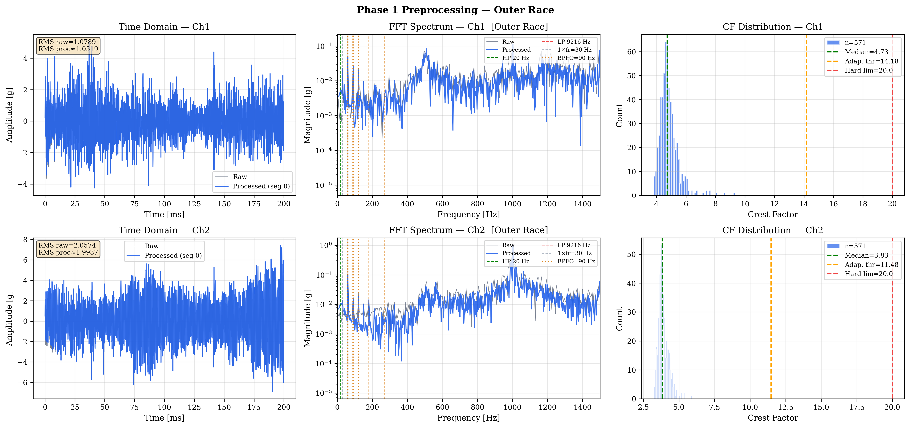

> *Raw (grey) vs. processed (blue) vibration signal, FFT spectrum with BPFO harmonic markers, and crest-factor distribution after outlier rejection.*

---

### Filter Bank Frequency Responses

Two Butterworth filters are designed and validated before any data is processed. The magnitude and phase responses confirm correct −3 dB cutoffs and the expected attenuation characteristics.

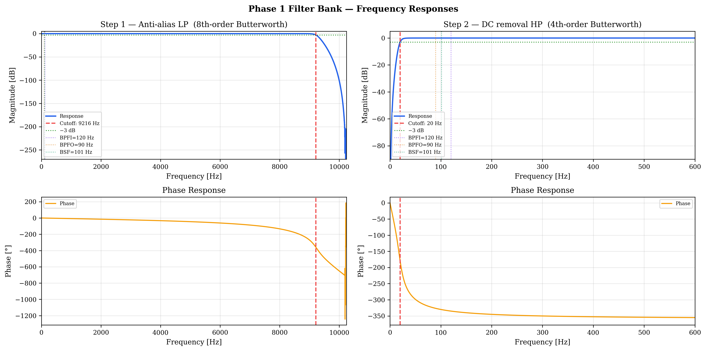

> *Top row: magnitude response [dB]. Bottom row: phase response. Left: 8th-order anti-alias LP (9216 Hz). Right: 4th-order DC-removal HP (20 Hz).*

---

### Dataset Statistics

After preprocessing and outlier rejection the five fault classes contain a balanced set of 8192-sample segments. The box plots confirm z-score normalisation, and the violin plots show the crest-factor spread per class — elevated crest factor in the Ball and Compound classes is physically consistent with impulsive rolling-element damage.

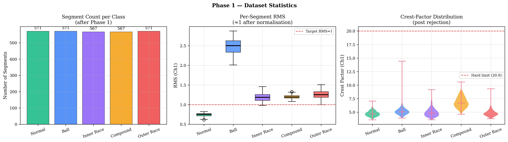

> *Left: segment count per class. Centre: per-segment RMS distribution (Ch1). Right: crest-factor violin plots after outlier rejection.*

---

### FFT Spectral Analysis

Mean amplitude spectra (± 1σ shaded band) are computed from all segments via windowed FFT with Hann taper and amplitude correction. Each subplot overlays only the fault frequencies relevant to that class, preventing visual clutter.

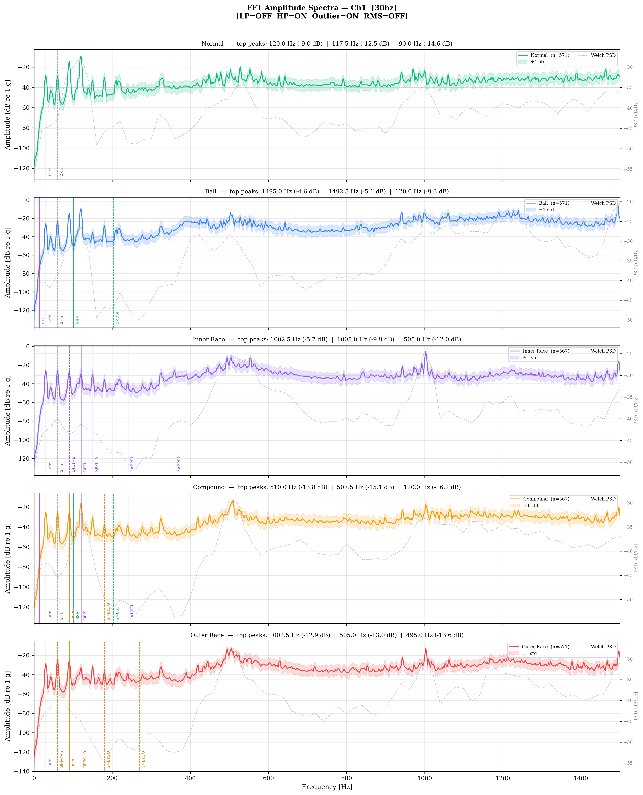

> *Per-class mean FFT spectrum (Ch1, 0–1500 Hz). Coloured vertical markers indicate class-selective characteristic frequencies: BPFO/harmonics (amber), BPFI/harmonics (violet), BSF (green), FTF (pink), shaft (grey).*

The overlay plot places all five classes on a single axis to reveal inter-class spectral differences directly.

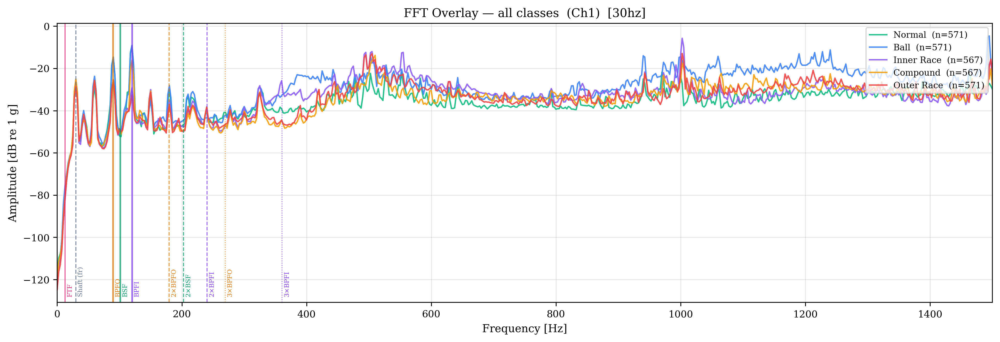

> *All five fault classes overlaid. The Normal class shows a smooth broadband floor; fault classes exhibit elevated peaks at their characteristic frequencies.*

---

### STFT Spectrogram Analysis

Short-Time Fourier Transform spectrograms (Hann window, N=512, 75% overlap, Δf ≈ 40 Hz, Δt ≈ 6.25 ms) show how fault energy distributes over time and frequency within a single 400 ms segment. Horizontal dashed lines mark the relevant characteristic frequencies for each class.

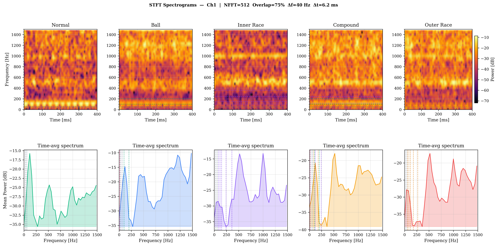

> *Top row: STFT power spectrogram (inferno colourmap, dB scale). Bottom row: time-averaged spectrum. Horizontal markers show class-selective fault frequencies.*

The resolution trade-off figure demonstrates how window length affects time vs. frequency resolution.

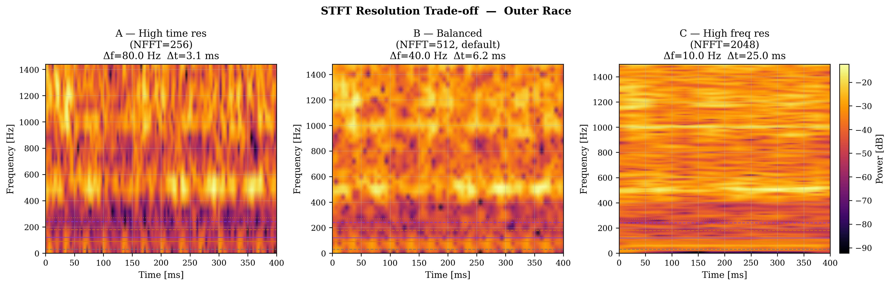

> *Left: high time resolution (NFFT=256, Δf=80 Hz). Centre: balanced default (NFFT=512). Right: high frequency resolution (NFFT=2048, Δf=10 Hz).*

---

### Feature Extraction

Eighteen scalar features are extracted per segment per channel across three domains:

| Domain | Features |
|---|---|
| Time domain | RMS, Peak, Crest Factor, Kurtosis, Skewness |
| Spectral (FFT) | Centroid, Bandwidth, Spectral Kurtosis, Peak Frequency, Peak Amplitude, Band Energy Ratios |
| STFT-based | Mean Energy, Energy Variance, Temporal Centre of Gravity |

**Violin + strip plots** show per-class feature distributions and confirm strong class separability for kurtosis, spectral centroid, and band energy ratios.

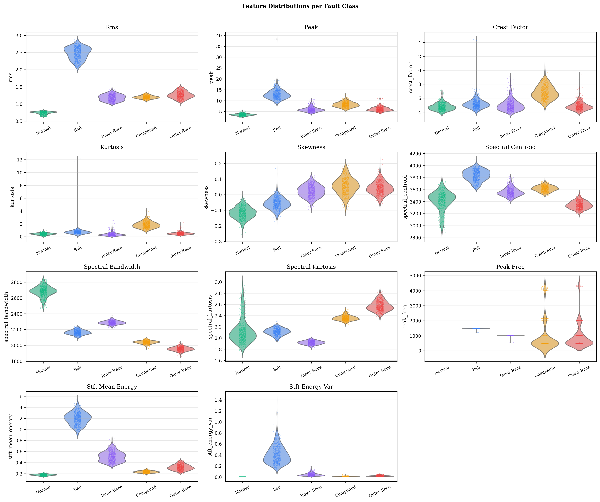

> *Violin plots (shape = distribution) with strip overlay (individual segments). Features with non-overlapping distributions are the most useful for fault classification.*

**Scatter plot** of kurtosis vs. spectral centroid shows clear cluster separation between Normal, Inner Race, and Outer Race.

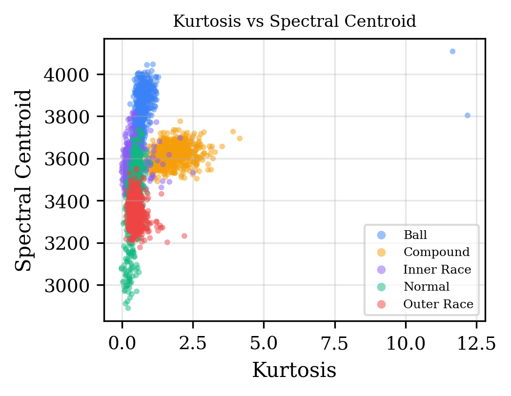

> *Each point is one segment. Clusters confirm that kurtosis and spectral centroid together separate the five fault classes.*

**Feature correlation heatmap** identifies redundant features. Highly correlated pairs (|r| > 0.85) can be pruned before training without information loss.

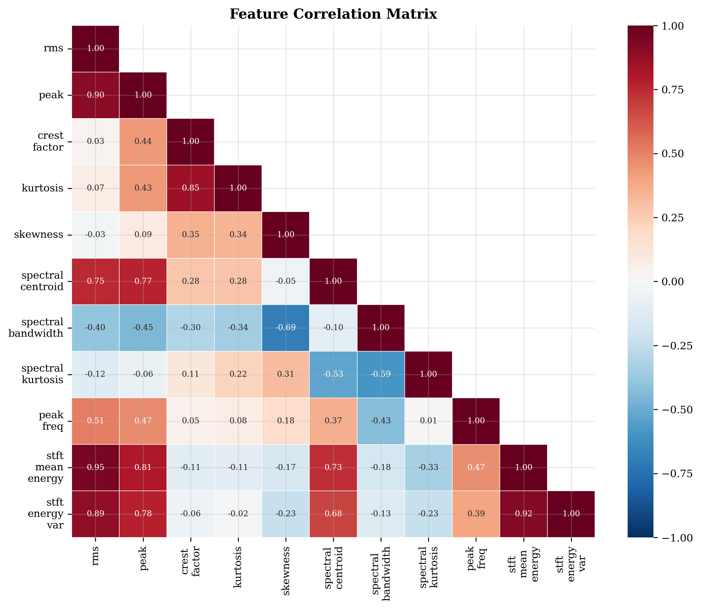

**Radar chart** normalises all features to [0, 1] and overlays mean profiles per class, making it easy to see which fault type has the highest energy, most impulsive behaviour, or highest-frequency spectral content.

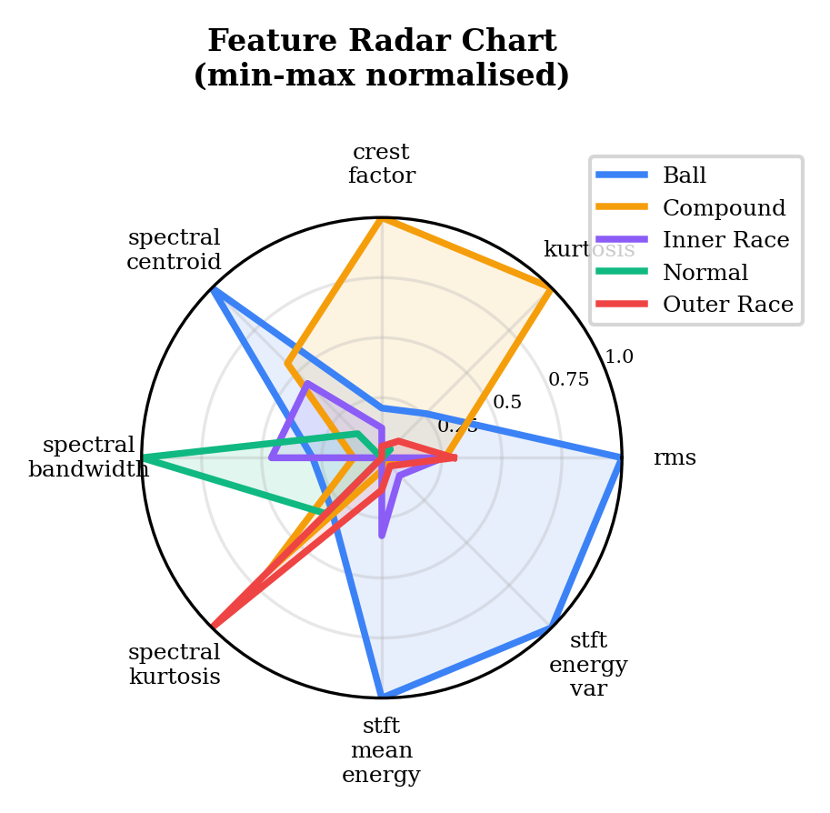

**Band energy heatmap** shows the fraction of total spectral power in each frequency octave per class. Outer Race energy concentrates in the 100–300 Hz band (consistent with BPFO and its harmonics); Inner Race energy is distributed higher due to BPFI sidebands.

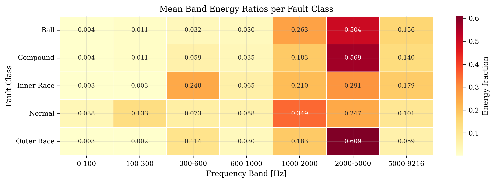

---

### Envelope Spectrum Analysis (Kurtogram-Guided)

Raw FFT cannot reliably reveal bearing fault rates because impulse energy modulates a high-frequency resonance carrier rather than appearing as a direct low-frequency tone. The Envelope Spectrum Analysis (ESA) pipeline addresses this with five steps:

1. **Spectral Kurtosis scan** — sweeps centre frequency and bandwidth at four resolution levels to find the resonance band most excited by bearing impacts (Antoni 2006/2007).
2. **Kurtogram-guided bandpass filter** — 4th-order zero-phase Butterworth filter centred on the optimal band.
3. **Hilbert demodulation** — `envelope(t) = |analytic_signal(t)|`.
4. **Envelope FFT** — bearing fault rates (BPFO, BPFI, BSF, FTF) now appear as discrete spectral lines.
5. **Peak-ratio diagnostics** — Harmonic Sum Scores (HSS) quantify peak amplitude at each fault frequency relative to the noise floor.

#### Kurtograms

The kurtogram visualises kurtosis as a function of (centre frequency, bandwidth). The red rectangle marks the automatically selected optimal demodulation band for each fault class.


> *Outer Race: the optimal band (red rectangle) sits in the 3–5 kHz resonance region, consistent with bearing housing natural frequency. K > 3 confirms impulsive fault activity.*

#### Envelope Spectra per Class

After demodulation, the bearing fault rate peaks appear clearly as discrete lines. Class-selective markers annotate only the frequencies relevant to each fault type.


> *Mean envelope spectrum ± 1σ (50 segments averaged per class). Downward triangles mark detected peaks at characteristic frequencies. Each text box shows HSS diagnostic scores and dominant fault identification.*

#### Raw FFT vs. Envelope Spectrum Comparison

The side-by-side comparison demonstrates the core advantage of the envelope method: fault peaks invisible in the raw FFT become prominent after demodulation.


> *Left column: raw FFT — fault peaks masked by structural resonances and shaft harmonics. Right column: envelope spectrum after kurtogram-guided demodulation — BPFO, BPFI, BSF clearly resolved.*

#### Diagnostic Summary

The HSS bar chart and log-ratio classifier feature quantify fault severity across all five classes. A detection threshold of HSS > 3 is applied following Randall & Antoni (2011).


> *Left: Harmonic Sum Scores per fault-frequency family per class. Right: log(A_BPFI / A_BPFO) — positive values indicate inner-race fault; negative values indicate outer-race fault.*

---

## Technical Summary

| Property | Value |
|---|---|
| Bearing type | 61800-type DGBB · Nb=7, Bd=2.1 mm, Pd=14.5 mm, α=0° |
| Shaft speed | 1800 RPM (fr = 30 Hz) |
| Sampling rate | 20 480 Hz |
| Channels | 2 (horizontal + vertical acceleration) |
| Fault classes | Normal · Ball · Inner Race · Compound · Outer Race |
| Segment length | 8192 samples (400 ms) · 50% overlap |
| Preprocessing | HP filter 20 Hz + crest-factor outlier rejection + z-score |
| FFT | Hann window · amplitude-corrected · dB scale |
| STFT | N=512 · 75% overlap · Δf=40 Hz · Δt=6.25 ms |
| Features | 18 per segment per channel |
| Envelope method | SK kurtogram → BP filter → Hilbert transform → FFT |
| Diagnostic metric | Harmonic Sum Score (HSS) + log-ratio classifier |

---

## Characteristic Frequencies

| Frequency | Symbol | Value |
|---|---|---|
| Shaft | fr | 30.000 Hz |
| Cage | FTF | 12.828 Hz |
| Ball spin | BSF | 101.343 Hz |
| Outer race | BPFO | 89.793 Hz |
| Inner race | BPFI | 120.207 Hz |
| Sanity check | BPFO + BPFI = Nb × fr | 210.0 Hz ✓ |

---

## Pipeline Architecture

```
Raw .txt files  (Chan1.txt · Chan2.txt)
        │
        ▼
Cell 1 ── Config + bearing geometry calculator
              Derives BPFO · BPFI · BSF · FTF from Nb, Bd, Pd, α
        │
        ▼
Cell 2 ── Data loading + Phase 1 preprocessing
              HP filter → segmentation → crest-factor rejection → z-score
        │
        ▼
Cell 3 ── FFT analysis
              Windowed FFT → mean/std spectra → class-selective markers
        │
        ▼
Cell 4 ── STFT analysis
              Hann STFT → spectrograms → time-averaged spectra
        │
        ▼
Cell 5 ── Feature extraction
              18 features/segment → DataFrame → distributions · scatter · radar
        │
        ▼
Cell 6 ── Envelope spectrum analysis
              SK kurtogram → BP filter → Hilbert → ESA → HSS diagnostics
```

---

## Dependencies

```
numpy · pandas · scipy · matplotlib · seaborn · scikit-learn · torch · tqdm
```

```bash
pip install -r requirements.txt
jupyter notebook FMA_Bearing_Fault_Diagnosis.ipynb
```

Run cells in order: Cell 1 → Cell 6.

---

## References

- Antoni J. (2006). *The spectral kurtosis: a useful tool for characterising non-stationary signals*. Mechanical Systems and Signal Processing, 20(2), 282–307.
- Antoni J. (2007). *Fast computation of the kurtogram for the detection of transient faults*. Mechanical Systems and Signal Processing, 21(1), 108–124.
- Randall R. B. & Antoni J. (2011). *Rolling element bearing diagnostics — a tutorial*. Mechanical Systems and Signal Processing, 25(2), 485–520.

---

## License

MIT — free to use, adapt, and cite.
